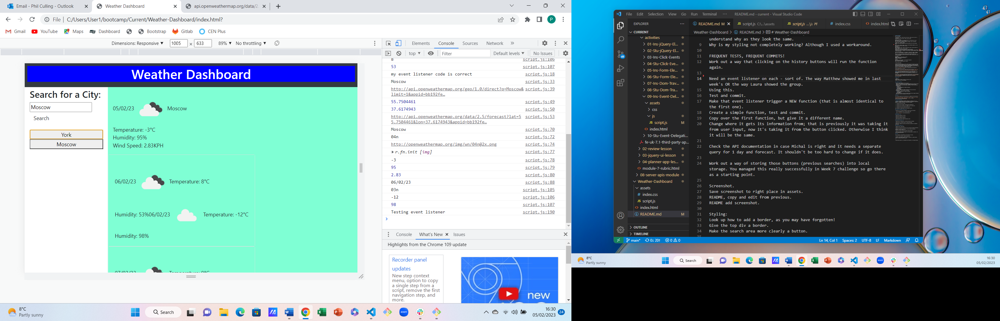

# Weather-Dashboard
Week 8 Challenge

Further practice with JavaScript and jQuery
## Description
I wanted to create a weather dashboard.
I wanted the dashboard to have an option for the user to input their city of choice.
After the user had clicked on "Search", I wanted the dashboard to display weather information for the current day and next 5 days for that location.
I wanted the dashboard to clear and show information for a different city when the user updated their input.
I wanted the previous user inputs to be saved as buttons.
I wanted the saved buttons to be able to be selected by the user and update the browser with weather information when clicked on.
I wanted the app to store the user input information into local storage such that it would continue to appear on refresh.
I wanted to practise use of APIs and jQuery to achieve this, especially functions, the use of .on('click') and local storage.
I wanted to deploy my finished product and check it had no errors.

## Installation
n/a

## Usage
When the website is viewed, the user can search for a city. After entering the name of the city and clicking on 'Search' the user will see weather information for that city, both today's information and a 5-day forecast. The user can add other cities to view more weather information. The user's search history is saved on screen as buttons. The buttons can be clicked on and the browser will refresh and update with weather information for that city.

Site is published at https://philculling.github.io/weather_dashboard 

Screenshot:

## Credits
Some help was provided by a tutor session.

## License
Please refer to the LICENSE in the repo.